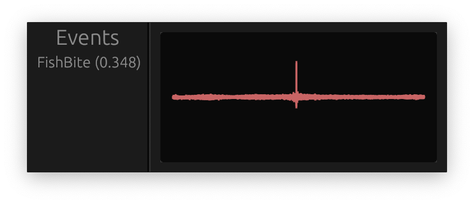

# frosk


This is a toy project which contains a prototype for a World of Warcraft fishing bot with a unique approach. It works by capturing the audio directly from the game and performing realtime digital signal processing to detect the sound of a fish biting. The bot then automatically reels in the fish and casts the line again.

More specifically, it works by maintaining a buffer of the most recently captured game audio. It then cross-correlates this buffer with a target signal (static sound of a fish biting). If the correlation is sufficiently high, the bot will simulate a key press to reel in the fish.

## Usage
```bash
cargo run -r --bin gui
```

## Tests
```bash
cargo test
```

## Benchmarks
```bash
cargo bench
```
